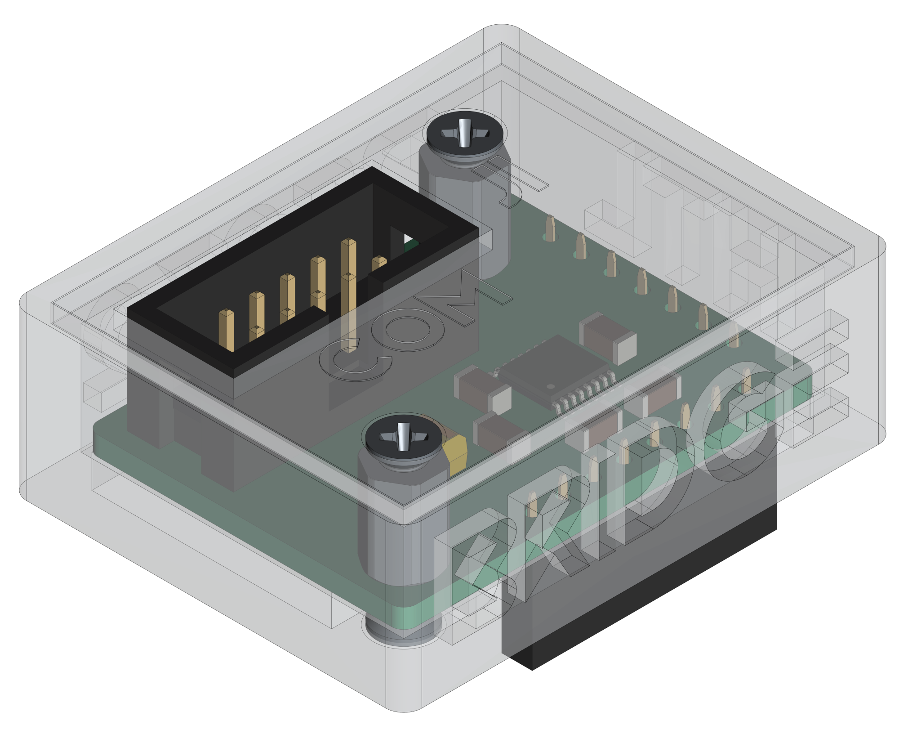
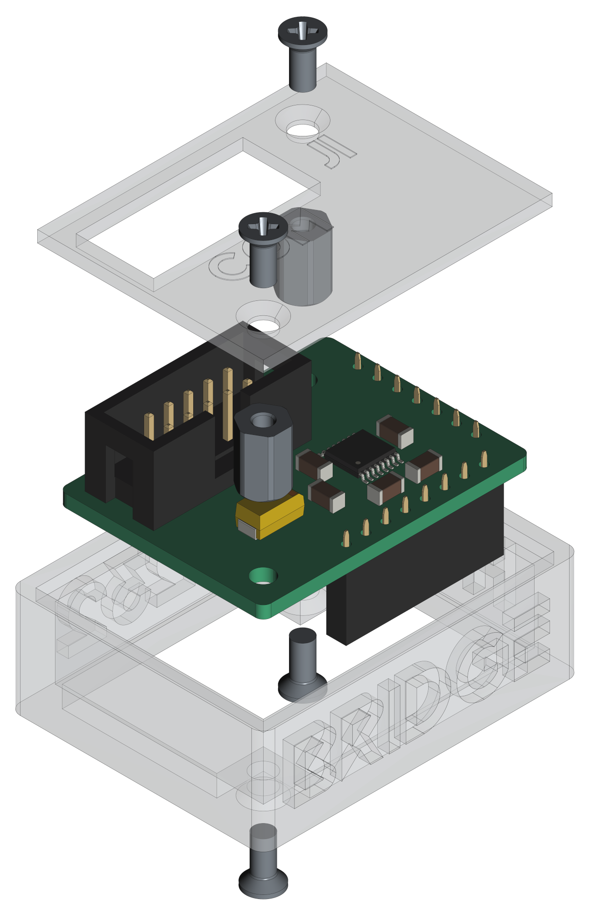

[](https://github.com/0x007e/u3a_rs232) [](https://creativecommons.org/licenses/by-nc-sa/4.0/legalcode) 

# `U3A_rs232` - RS232 - Adapter for U3A

[](https://deepwiki.com/0x007E/u3a_rs232)

The `U3A_rs232` project is based on a ([MAX3232](#additional-information)) that ist used to change the TTL/CMOS level to the required level of TIA/EIA-232-F standard. It can simply be adapted to the [U3A-Module](https://github.com/0x007e/u3a). The Module can be used with a [DSUB](https://www.reichelt.de/de/de/shop/produkt/d-sub-stecker_9-pol_flachbandkabel_ohne_isolator-6987) connector.

> To use it with a [DSUB](https://www.reichelt.de/de/de/shop/produkt/d-sub-stecker_9-pol_flachbandkabel_ohne_isolator-6987) connector it is necessary to create a connector cable that can be plugged into the IDC connector.

| Experience | Level |
|:------------|:-----:|
| Soldering   |  |
| Mechanical  |  |

# Downloads

| Type      | File               | Description              |
|:---------:|:------------------:|:-------------------------|
| Schematic | [pdf](https://github.com/0x007E/u3a_rs232/releases/latest/download/schematic.pdf) / [cadlab](https://cadlab.io/project/29701/main/files) | Schematic files |
| Board | [pdf](https://github.com/0x007E/u3a_rs232/releases/latest/download/pcb.pdf) / [cadlab](https://cadlab.io/project/29701/main/files) | Board file |
| Drill | [pdf](https://github.com/0x007E/u3a_rs232/releases/latest/download/drill.pdf) | Drill file |
| PCB | [zip](https://github.com/0x007E/u3a_rs232/releases/latest/download/kicad.zip) / [tar](https://github.com/0x007E/u3a_rs232/releases/latest/download/kicad.tar.gz) | KiCAD/Gerber/BoM/Drill files |
| Mechanical | [zip](https://github.com/0x007E/u3a_rs232/releases/latest/download/freecad.zip) / [tar](https://github.com/0x007E/u3a_rs232/releases/latest/download/freecad.tar.gz) | FreeCAD/Housing and PCB (STEP) files     |

# Hardware

There are two parts of the hardware. The pcb and the housing of the `U3A_rs232`. The pcb is created with [KiCAD](#additional-information) and the housing with [FreeCAD](#additional-information). All files are built with `github actions` so that they are ready for a production environment. The housing is printed with a 3D-printer (`Dremel 3D40`).

## PCB

The circuit board is populated on both sides (Top, Bottom). The best way for soldering the `SMD` components is within a vapor phase soldering system and for the `THT` components with a standard soldering system.

### Top Layer


### Bottom Layer


## Mechanical

The housing has a tolerance of `0.2mm` on each side of the case. So the pcb should fit perfectly in the housing. The tolerance can be modified with `FreeCAD` in the `Parameter` Spreadsheet.

### Assembled



#### Exploded



# Connection/Setup

The `U3A_rs232` is powerd over the `U3A` board with `5V`. The voltage of the pins are driven by a `MAX3232` that creates its own voltage for data transmission that meets the TIA/EIA-232-F standard.

## Simple loopback setup for testing purpose

``` bash
#
#            +--------------------------------+           +-----------------------------------+      +---------------------+
#            |                              J2|           |J2     U                       +---+---+  |                     |
#            | J1         U3A_rs232        +--+--+     +--+--+    S                U      |  USB  |--+ +-----------------+ |
#         +--+--+                          | VCC +-----+ VCC |    B      UPDI      3      +---+---+  | | TeraTerm        | |
#         + GND | (5)                      | GND +-----+ GND |    /    +---+---+   A          |      | | ~~~~~~~~        | |
#         +-----+                          |  X  +-----| PDI |    U    |   |   |              |      | | ~~~~~           | |
#   L     + CTS | (8)                      | CTS +-----+ CTS |    A    |   |   |              |      | | ~~~~~~~~~~~~    | |
#   O     + RTS | (7)                      | RTS +-----+ RTS |    R    | X | X |              |      | |                 | |
#   O +---+ TXD | (3)                      | TXD +-----+ TXD |    T    +---+---+     +-+      |      | +-----------------+ |
#   P +---+ RXD | (2)                      | RXD +-----+ RXD |    /                 / /       |      |                     |
#   B     +--+--+                          +--+--+     +--+--+    U               +-+-+-+-+-+-+      | Computer            |
#   A        |                                |           |       P               | 5V  | 3V3 |      |                     |
#   C        |                                |           |       D               +-----+-----+      +---------------------+
#   K        |                                |           |       I         J4                |
#            |                                |           | +---+---+---+---+---+---+---+---+ |
#            |                                |           | | V | C | C | D | D | D | R | G | |
#            |                                |           +-+ C | B | B | C | T | C | I | N +-+
#            |                                |             | C | 3 | 2 | D | R | R |   | D |
#            +--------------------------------+             +---+---+---+---+---+---+---+---+
```

# Additional Information

| Type       | Link                                                     | Description                                          |
|:----------:|:--------------------------------------------------------:|:-----------------------------------------------------|
| MAX3232    | [pdf](https://www.ti.com/lit/ds/symlink/max3232e-q1.pdf) | UART / RS232 level converter                         |
| KiCAD      | [web](https://www.kicad.org/)                            | KiCAD project page                                   |
| FreeCAD    | [web](https://www.freecad.org/)                          | FreeCAD project page                                 |

---

R. GAECHTER
